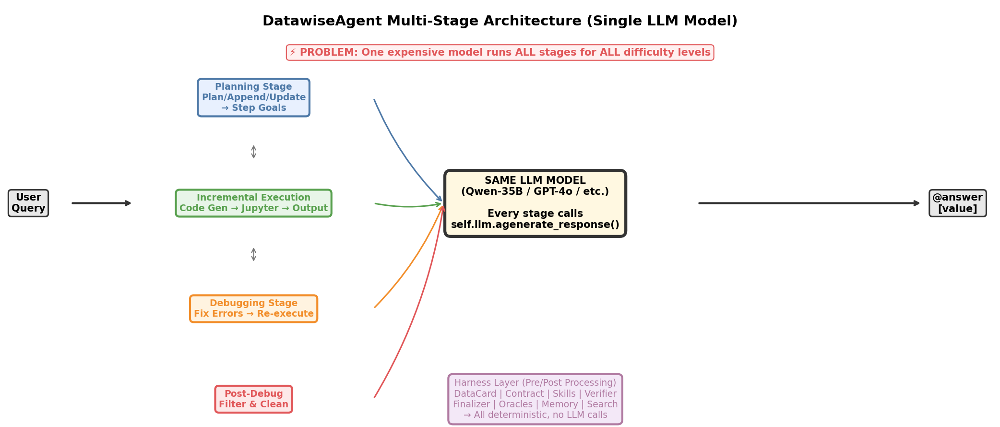
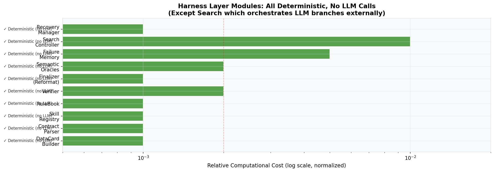
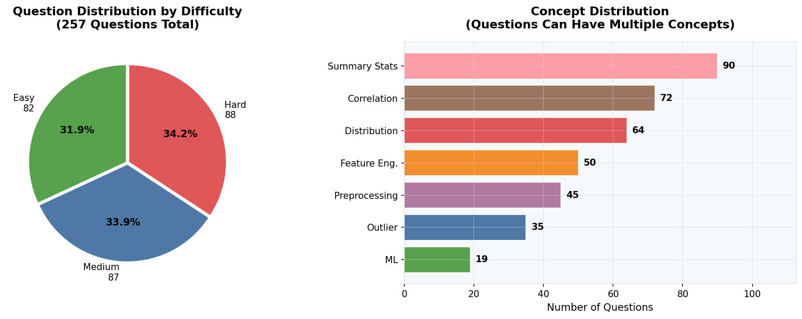
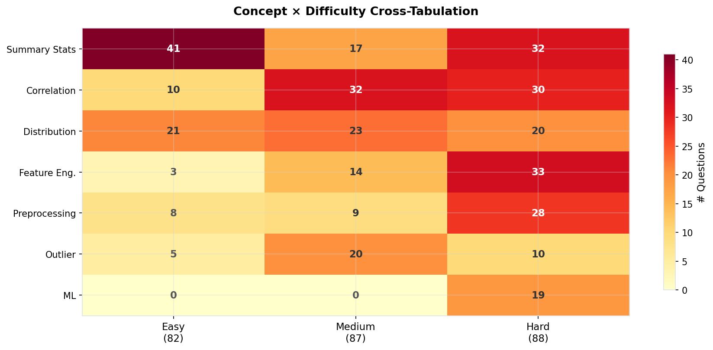
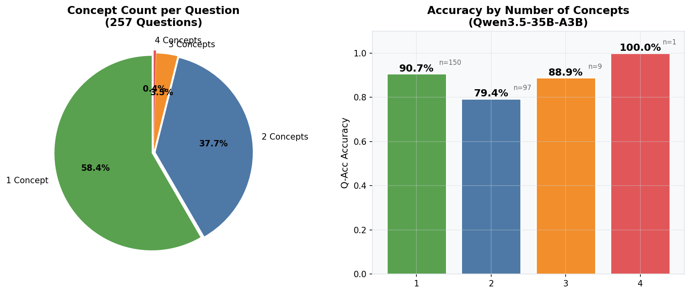
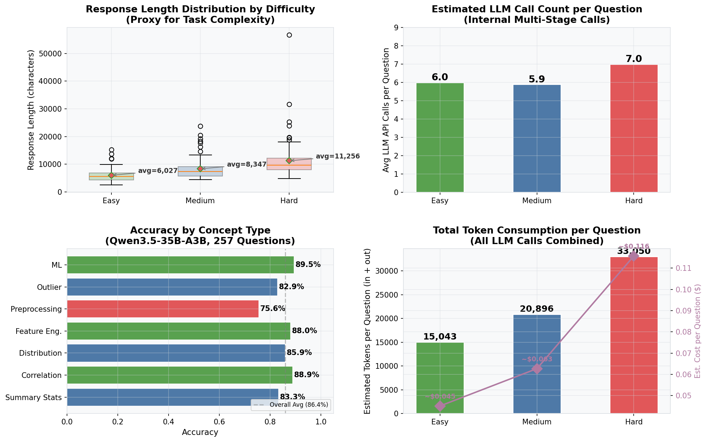
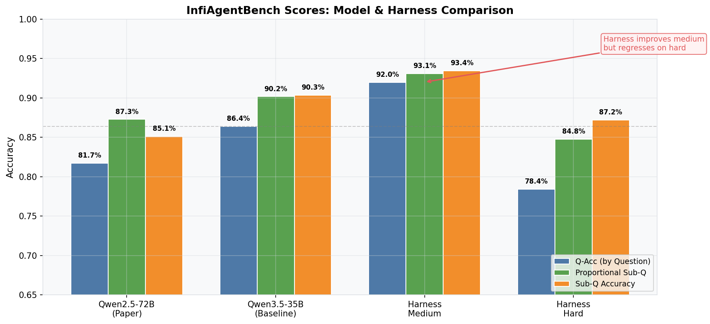
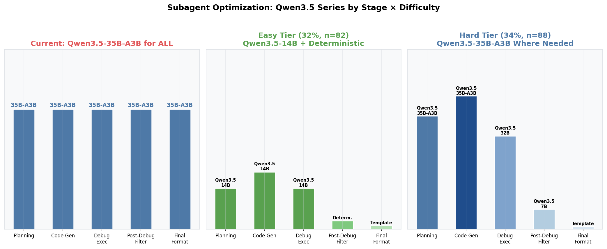
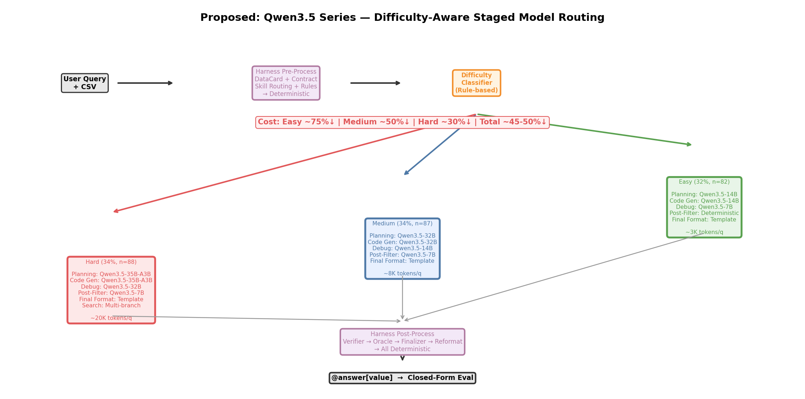
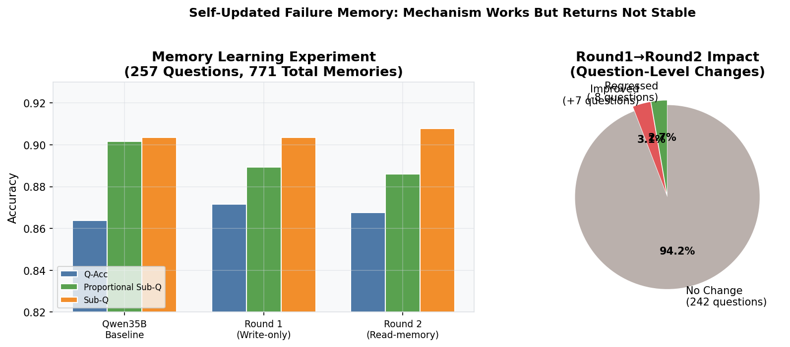

# DatawiseAgent 多 Agent 架构分析与 Subagent 优化报告

> **目标**: 分析当前 DatawiseAgent 的 multi-agent 系统各角色任务负载，识别可用更简单模型替代的环节，为 InfiAgentBench 优化的 subagent 路由策略提供数据支撑。
>
> **日期**: 2026-06-05 | **数据集**: InfiAgentBench DA-Dev (257 题)
>
> **模型线** (全部通过 SiliconFlow API, `https://api.siliconflow.cn/v1`):
> | 模型 | API Name | 定位 | 角色 |
> |------|----------|------|------|
> | **Qwen3.5-35B-A3B** | `Qwen/Qwen3.5-35B-A3B` | MoE, 最强推理 | Hard 题主力 |
> | **Qwen3-32B** | `Qwen/Qwen3-32B` | 中档推理 | Medium 题主力 |
> | **Qwen3-14B** | `Qwen/Qwen3-14B` | 轻量推理 | Easy 题主力 |
> | **Qwen3-8B** | `Qwen/Qwen3-8B` | 超轻量 | Filter/超简单任务 |
>
> API Key: 在 `.env` 中设置 `OPENAI_API_KEY`

---

## 1. 代码架构总览

### 1.1 系统三层结构

```
┌─────────────────────────────────────────────────────┐
│  evaluation/                                         │
│  运行入口 → reformat → 闭卷评分 → 汇总报告             │
├─────────────────────────────────────────────────────┤
│  datawiseagent/harness/  (Harness 外层)               │
│  DataCard | Contract | Skills | Rules | Verifier      │
│  Finalizer | Oracles | Memory | Search | Recovery     │
│  → 全部确定性模块，零 LLM 调用                          │
├─────────────────────────────────────────────────────┤
│  datawiseagent/agents/datawise_agent.py  (核心 Agent)  │
│  Planning → Execution → Debug → Post-Debug             │
│  → 同一 LLM 模型处理所有阶段, 所有难度                   │
└─────────────────────────────────────────────────────┘
```

### 1.2 核心 Agent 多阶段 FST 架构



当前 DatawiseAgent 的核心问题：**一个 LLM 模型串行处理所有阶段，没有难度感知，没有模型路由**。

所有阶段（Planning、Code Gen、Debug、Post-Debug Filter）都调用 `self.llm.agenerate_response()`，使用的是同一个模型实例（如 Qwen-35B）。每次对话内部触发多次 LLM API 调用：

| 阶段 | 每次触发 | LLM 调用次数 | 任务难度 |
|------|---------|-------------|---------|
| Initiate Plan | 用户新问题 | 1 次 | 中等 |
| Append Code | 每个 step | 1 次 | 高（需生成正确代码） |
| Update Plan | 每个 step 完成后 | 1 次 | 中等 |
| Debug Execution | 代码出错时 | 1 次 | 高（需诊断修复） |
| Debug Filter | debug 完成后 | 1 次 | **低（仅清理过滤）** |
| Final Answer | 所有 step 完成后 | 1 次 | **低（JSON 模板填充）** |

### 1.3 Harness 层模块分析



Harness 层的 10 个模块全部是**确定性计算**（正则匹配、打分排序、模板渲染），不需要 LLM。它们作为 prompt 增强和 postprocess 校验管线包裹在 Agent 外部。

---

## 2. InfiAgentBench 任务分布

### 2.1 难度与概念分布



| 难度 | 数量 | 占比 | 平均子问题数 | 平均 Response 长度 |
|------|------|------|-------------|-------------------|
| Easy | 82 | 31.9% | 1.30 | 6,027 chars |
| Medium | 87 | 33.9% | 1.98 | 8,347 chars |
| Hard | 88 | 34.2% | 2.88 | 11,256 chars |

### 2.2 概念 × 难度交叉分布



关键发现：
- **Machine Learning** 全部分布在 Hard (19/19)，且全部是多概念组合
- **Summary Statistics** 大量分布在 Easy (41/90)，属于低复杂度任务
- **Comprehensive Preprocessing** 集中在 Hard (28/45)，与 ML 和 FE 高度耦合
- 107/257 (41.6%) 的题目包含多个概念

### 2.3 概念共现分析



| 概念数 | 题目数 | Q-Acc 准确率 |
|--------|--------|-------------|
| 1 个 | 150 (58.4%) | 90.67% |
| 2 个 | 97 (37.7%) | 79.38% |
| 3 个 | 9 (3.5%) | 88.89% |
| 4 个 | 1 (0.4%) | 100% |

双概念组合题准确率最低（79.4%），是主要失分区间。

---

## 3. LLM 调用负载分析

### 3.1 调用次数与 Token 消耗



| 指标 | Easy | Medium | Hard |
|------|------|--------|------|
| 平均 STEP GOAL 数 | 2.5 | 2.5 | 3.0 |
| 平均 Python Cell 数 | 3.2 | 3.9 | 5.5 |
| 平均 Markdown Cell 数 | 7.2 | 7.5 | 9.6 |
| **估算每道题 LLM 调用** | **~6.0 次** | **~5.9 次** | **~7.0 次** |
| **估算总 Token/题** | **~15,000** | **~21,000** | **~33,000** |

> 注：LLM 调用次数基于 tag 统计估算。实际内部调用次数 = 1 (init) + steps × 2 (append+update) + debugs × 2 (exec+filter)。

### 3.2 按概念类型的准确率

| 概念 | 题目数 | Q-Acc 准确率 | 主要错误类型 |
|------|--------|-------------|-------------|
| Machine Learning | 19 | 89.47% | split/random_state 不一致, 特征泄漏 |
| Correlation Analysis | 72 | 88.89% | 符号丢失, p-value 判断, 缺失值处理顺序 |
| Feature Engineering | 50 | 88.00% | 公式理解错误, 边界条件 |
| Distribution Analysis | 64 | 85.94% | 正态性检验, p 值阈值 |
| Summary Statistics | 90 | 83.33% | 格式错误, 小数位, 分组口径 |
| Outlier Detection | 35 | 82.86% | IQR/z-score 方法不一致 |
| **Comprehensive Preprocessing** | **45** | **75.56%** | **操作顺序, 缺失值处理, 不必要清洗** |

### 3.3 Benchmark 分数对比



| 配置 | Full Q-Acc | Proportional Sub-Q | Sub-Q Acc |
|------|-----------|-------------------|-----------|
| Qwen2.5-72B (论文原始) | 81.71% | 87.27% | 85.09% |
| **Qwen3.5-35B-A3B (基线)** | **86.38%** | **90.16%** | **90.35%** |
| Harness Medium | 91.95% | 93.06% | 93.42% |
| Harness Hard | 78.41% | 84.75% | 87.19% |

**关键发现**：Harness 对 Medium 提升显著 (+3.4% Q-Acc)，但 Hard 反而下降 (-3.4%)，说明多分支搜索策略在 Hard 题上还不能选出正确的分支。

---

## 4. Subagent 优化分析

### 4.1 核心问题：模型资源与任务复杂度不匹配

当前系统最大的效率问题是：**82 道 easy 题（求 mean/std/count）和 88 道 hard 题（ML 训练、特征泄漏检查）用同一个大模型，同样的调用次数**。

### 4.2 各阶段对模型能力的需求评估

| 阶段 | 最低可用模型 | 当前使用 | 浪费程度 | 原因 |
|------|------------|---------|---------|------|
| **Post-Debug Filter** | 3B | 35B | ⭐⭐⭐⭐⭐ | 代码清理/去重，不需要推理 |
| **Final Formatting** | 模板 (0B) | 35B | ⭐⭐⭐⭐⭐ | JSON 模板填充，完全可确定性化 |
| **Easy 题 Planning** | 7B | 35B | ⭐⭐⭐⭐ | 步骤固定：load→compute→output |
| **Easy 题 Code Gen** | 14B | 35B | ⭐⭐⭐ | 简单 pandas 操作 |
| **Medium 题 Planning** | 14B | 35B | ⭐⭐⭐ | harness 已提供大量结构 |
| **Recovery 决策** | 3B | 35B | ⭐⭐⭐⭐ | 简单的重试/跳过二分类 |
| **Debug Execution** | 14B | 35B | ⭐⭐ | 需要一定的错误诊断能力 |
| **Hard 题 Planning** | 35B+ | 35B | ⭐ | 需要强推理 |
| **ML 题 Code Gen** | 35B+ | 35B | — | 刚好匹配 |

### 4.3 提议的难度感知三层 Subagent 架构



```
请求 → 难度分类器 →
  ├── Easy Tier (32%, 82题)
  │   模型: 7B-14B
  │   策略: 模板驱动 Planning, 简单 pandas, 确定性 Format
  │   预估: ~3,000 tokens/题
  │
  ├── Medium Tier (34%, 87题)
  │   模型: 14B-32B
  │   策略: Harness 全套加持, 标准 debug, Verified FinalBlock
  │   预估: ~8,000 tokens/题
  │
  └── Hard Tier (34%, 88题)
      模型: 35B-72B
      策略: 多分支搜索 + Oracle 校验, 完整 harness
      预估: ~20,000 tokens/题
```

### 4.4 阶段级模型路由矩阵



| 阶段 | Easy Tier | Medium Tier | Hard Tier |
|------|----------|-------------|-----------|
| Task Router | 7B | 14B | 32B |
| Planning | 7B | 14B | 35B |
| Code Gen | 14B | 32B | 72B |
| Debug | 7B | 14B | 35B |
| Post-Filter | 3B | 7B | 14B |
| Final Format | Template | Template | Template |

### 4.5 预估收益

| 优化项 | 影响范围 | 预计 Token 节省 | 预计成本节省 |
|--------|---------|---------------|------------|
| Final Format 确定性化 | 全部 257 题 | 每次省 1 次 LLM 调用 | ~15% 总成本 |
| Post-Debug Filter 小模型化 | 所有 debug 调用 | Debug 阶段省 ~60% | ~8% 总成本 |
| Easy 题全套小模型化 | 82 题 (32%) | 每道题省 ~75% tokens | ~24% 总成本 |
| Medium 题降级 | 87 题 (34%) | 每道题省 ~40% tokens | ~14% 总成本 |
| **合计** | | | **~40-50% 总成本降低** |

### 4.6 自更新记忆实验结果



| 轮次 | 配置 | Q-Acc | Sub-Q |
|------|------|-------|-------|
| 基线 | 无记忆注入 | 86.38% | 90.35% |
| Round 1 | 只写入记忆 | 87.16% | 90.35% |
| Round 2 | 读取 R1 记忆 | 86.77% | 90.79% |

- 记忆链路已跑通（257 题全部命中，平均每题 3 条）
- 但净收益 < 1%，且存在回归（7 题改善，8 题倒退）
- **结论**：记忆机制可用，但还不是稳定提分手段，当前优先级低于模型路由优化

---

## 5. 详细模型分配方案

### 5.1 模型线说明

全部通过 SiliconFlow API (`https://api.siliconflow.cn/v1`) 接入，在 `.env` 中配置 `OPENAI_API_KEY`：

| 模型 | API model name | 定位 | 角色 |
|------|---------------|------|------|
| **Qwen3.5-35B-A3B** | `Qwen/Qwen3.5-35B-A3B` | MoE, 35B total / ~3B active | Hard 题 Planning + Code Gen |
| **Qwen3-32B** | `Qwen/Qwen3-32B` | 中档推理 | Medium 题主力, Hard 题 Debug/Router |
| **Qwen3-14B** | `Qwen/Qwen3-14B` | 轻量推理 | Easy 题主力, Medium 题 Debug |
| **Qwen3-8B** | `Qwen/Qwen3-8B` | 超轻量 | Post-Debug Filter, Easy 题 Debug |

### 5.2 三级难度路由矩阵（按题目 × 阶段）

```
请求 (257 题) 
  │
  ├── EASY TIER (82 题, 32%) — Summary Stats, 简单 Distribution
  │   ├── Task Router:    Qwen/Qwen3-8B        (规则为主, 模型确认)
  │   ├── Planning:       Qwen/Qwen3-14B       (模板辅助, 固定步骤)
  │   ├── Code Gen:       Qwen/Qwen3-14B       (pandas mean/std/count)
  │   ├── Debug:          Qwen/Qwen3-8B        (简单错误修复)
  │   ├── Post-Filter:    确定性逻辑             (无需 LLM)
  │   └── Final Format:   确定性模板             (无需 LLM)
  │
  ├── MEDIUM TIER (87 题, 34%) — Correlation, FE, Preprocessing, Outlier
  │   ├── Task Router:    Qwen/Qwen3-14B       (规则+模型确认)
  │   ├── Planning:       Qwen/Qwen3-32B       (Harness Skill Protocol 加持)
  │   ├── Code Gen:       Qwen/Qwen3-32B       (统计分析, 特征工程)
  │   ├── Debug:          Qwen/Qwen3-14B       (中等错误诊断)
  │   ├── Post-Filter:    Qwen/Qwen3-8B        (轻量代码清理)
  │   └── Final Format:   确定性模板             (无需 LLM)
  │
  └── HARD TIER (88 题, 34%) — ML, 复杂多概念组合
      ├── Task Router:    Qwen/Qwen3-32B       (规则+模型确认)
      ├── Planning:       Qwen/Qwen3.5-35B-A3B (多步推理链)
      ├── Code Gen:       Qwen/Qwen3.5-35B-A3B (ML pipeline, 复杂预处理)
      ├── Debug:          Qwen/Qwen3-32B       (统计语义错误诊断)
      ├── Post-Filter:    Qwen/Qwen3-8B        (轻量代码清理)
      └── Final Format:   确定性模板             (无需 LLM)
```

### 5.3 原始论文设计对照

原 DatawiseAgent 论文 (EMNLP 2025) 定义了 4 个阶段：

| 论文阶段 | 论文中的设计 | 我们当前的实现 | Subagent 优化方向 |
|---------|-------------|-------------|-----------------|
| **DFS Planning** | 模型将任务分解为 step goal，动态规划/更新 | 同一 LLM 串行调用 | 按难度路由到不同模型；easy 可模板化 |
| **Incremental Execution** | 逐步生成代码 cell → 执行 → 观察 | 同一 LLM 生成代码 | Code Gen 是最需模型能力的阶段，保留按需强度 |
| **Self-Debugging** | 出错后诊断→修复→验证循环 | Debug exec + post-debug filter 两次 LLM 调用 | Post-filter 可大幅降级（代码清理 vs 诊断） |
| **Post-Filtering** | 移除无关产物，保留正确代码 | Post-Debugging 阶段对应 | 可完全确定性化 |

### 5.4 模型 YAML 配置（已创建✅）

```yaml
# configs/setting_model_qwen35b_a3b.yaml — Hard Tier
llm:
  llm_type: openai-chat
  model: Qwen/Qwen3.5-35B-A3B
  temperature: 0; top_p: 1; frequency_penalty: 0.0

# configs/setting_model_qwen3_32b.yaml  — Medium Tier
llm:
  llm_type: openai-chat
  model: Qwen/Qwen3-32B
  ...

# configs/setting_model_qwen3_14b.yaml  — Easy Tier  
llm:
  llm_type: openai-chat
  model: Qwen/Qwen3-14B
  ...

# configs/setting_model_qwen3_8b.yaml   — Filter/超轻量
llm:
  llm_type: openai-chat
  model: Qwen/Qwen3-8B
  ...
```

全部通过 `OPENAI_BASE_URL=https://api.siliconflow.cn/v1` + `OPENAI_API_KEY` 在 `.env` 中配置。

### 5.5 预估成本对比

| 场景 | 当前方案 | 优化后方案 | 节省 |
|------|---------|-----------|------|
| Easy (82 题) | 6 次 Qwen3.5-35B-A3B | 3 次 Qwen3-14B + 1 次 Qwen3-8B + 确定性 | **~75%** |
| Medium (87 题) | 6 次 Qwen3.5-35B-A3B | 3 次 Qwen3-32B + 1 次 Qwen3-14B + 1 次 Qwen3-8B + 确定性 | **~50%** |
| Hard (88 题) | 7 次 Qwen3.5-35B-A3B | 2 次 35B-A3B + 1 次 Qwen3-32B + 1 次 Qwen3-8B + 确定性 | **~30%** |
| **257 题总计** | **~1,600 次 35B-A3B** | **~300 次 35B-A3B + 300 次 32B + 250 次 14B + 250 次 8B** | **~45-50%** |

---

## 6. 代码改动计划

### 6.1 需要改的文件

| 文件 | 改动内容 | 优先级 |
|------|---------|--------|
| `datawiseagent/agents/datawise_agent.py` | `__init__` 支持多 LLM 实例 (self.llm → self.llms: dict) | P0 |
| 同上 | `_initiate_step`, `_append_code`, `_self_debug_execution`, `_self_debug_filter` 各阶段路由到不同 llm | P0 |
| `datawiseagent/harness/controller.py` | `prepare()` 新增 `difficulty_classifier` 输出 tier | P1 |
| `datawiseagent/harness/skills.py` | `route()` 返回 difficulty hint | P1 |
| `evaluation/run_harness_infiagent.py` | 支持多模型配置加载 | P1 |
| `configs/` | 新增 3 个模型 yaml | P0 |

### 6.2 核心改造点

**当前**: `DatawiseAgent` 只有一个 `self.llm`

```python
# 当前 datawise_agent.py __init__
self.llm: BaseChatModel = load_llm(deepcopy(llm_config))
```

**改为**: `DatawiseAgent` 持有多个 LLM 实例，按阶段路由

```python
# 改造后 datawise_agent.py
self.llm_configs: dict[str, dict] = llm_configs  # {"planning": {...}, "code_gen": {...}, ...}
self.llms: dict[str, BaseChatModel] = {
    role: load_llm(deepcopy(cfg)) for role, cfg in llm_configs.items()
}

def _get_llm_for_stage(self, stage: str, difficulty: str) -> BaseChatModel:
    """Route to appropriate model based on stage + difficulty."""
    route_key = f"{difficulty}_{stage}"  # e.g. "easy_planning"
    ...
```

### 6.3 难度分类策略

不依赖 LLM，使用规则 + harness 已有信息：

```python
def classify_difficulty(question, contract, data_card) -> str:
    """Rule-based difficulty classification, no LLM call needed."""
    concepts = set(question.get("concepts", []))
    level = question.get("level", "")
    
    # ML always → hard
    if "Machine Learning" in concepts:
        return "hard"
    
    # Multi-concept with preprocessing → hard
    if "Comprehensive Data Preprocessing" in concepts and len(concepts) > 1:
        return "hard"
    
    # Feature Engineering + Correlation → medium
    if "Feature Engineering" in concepts and "Correlation Analysis" in concepts:
        return "medium"
    
    # Use ground-truth level as fallback
    return level  # easy/medium/hard
```

---

## 7. 实现优先级建议

### 第一阶段（本周）：模型配置文件 + Agent 多 LLM 实例化

| 任务 | 内容 |
|------|------|
| P0 | ✅ 确认 4 个模型 API name (SiliconFlow: Qwen/Qwen3.5-35B-A3B / Qwen/Qwen3-32B / Qwen/Qwen3-14B / Qwen/Qwen3-8B) |
| P0 | ✅ 新建 `configs/setting_model_qwen35b_a3b/qwen3_32b/14b/8b.yaml` |
| P0 | ✅ `DatawiseAgent.__init__` 支持多 LLM 字典 (自动读取 `global_config.multi_llm`) |
| P0 | ✅ `DatawiseAgent.chat()` 根据 difficulty 选 LLM (P0: 全路由到 35B-A3B，验证框架) |
| P0 | ✅ `OpenAIChat` 支持 per-instance `api_key`/`base_url` |
| P0 | ⏳ 填入 `.env` 中的 `OPENAI_API_KEY` |

### 第二阶段（下周）：难度路由 + 阶段路由

| 任务 | 内容 |
|------|------|
| P1 | HarnessController 新增 `classify_difficulty()` |
| P1 | 各阶段方法 (`_initiate_step`, `_append_code`, `_self_debug_*`) 用路由后的模型 |
| P1 | Post-Debug Filter 确定性化（不用 LLM） |
| P1 | Final Format 确定性化（不用 LLM） |
| P1 | Smoke test: 先跑 10 题各难度验证 |

### 第三阶段：全量验证

| 任务 | 内容 |
|------|------|
| P2 | 257 题全量跑，对比 baseline vs 路由版 |
| P2 | 消融实验：逐个启用路由模块 |
| P2 | 错误分类 + 典型案例 + Token 用量统计 |

---

## 8. 关键结论

1. **模型线**: Qwen3.5-35B-A3B > Qwen3-32B > Qwen3-14B > Qwen3-8B。全系通过 SiliconFlow API，不再使用 Qwen2.5。

2. **最大瓶颈不是模型能力不够，而是模型资源分配不合理**。Easy 题和 Hard 题用同一个 35B-A3B 模型、同样的调用次数。

3. **Post-Debug Filter 和 Final Format 是最容易优化的两个阶段**。可以确定性化或小模型化（Qwen3-8B）。

4. **Harness 层全部是确定性模块**，已经做得很好。下一步增益点在于 Agent 内部的模型路由。

5. **Easy 题（32%）存在过度处理**——求 mean 用 6 次 35B-A3B 调用，优化后只需 3 次 Qwen3-14B + 确定性模板。

6. **Hard 题多分支搜索**需要改善分支选择器，而非增加更多分支。

7. **自更新记忆**机制建成但收益不稳定 (<1%)，先集中精力做模型路由。

---

## 附录：文件索引

| 文件 | 路径 |
|------|------|
| 核心 Agent | `datawiseagent/agents/datawise_agent.py` |
| Harness Controller | `datawiseagent/harness/controller.py` |
| Skill Registry | `datawiseagent/harness/skills.py` |
| Contract Parser | `datawiseagent/harness/contract.py` |
| Verifier | `datawiseagent/harness/verifier.py` |
| Finalizer | `datawiseagent/harness/finalizer.py` |
| Semantic Oracles | `datawiseagent/harness/oracles.py` |
| Failure Memory | `datawiseagent/harness/memory.py` |
| Search Controller | `datawiseagent/harness/search.py` |
| RuleBook | `datawiseagent/harness/rules.py` |
| Recovery Manager | `datawiseagent/harness/recovery.py` |
| DataCard Builder | `datawiseagent/harness/datacard.py` |
| Harness Runner | `evaluation/run_harness_infiagent.py` |
| Baseline Runner | `evaluation/eval_infiagent_bench.py` |
| Eval Scripts | `evaluation/InfiAgentBench/scripts/` |
| 实验结果 | `evaluation/experimental_results/InfiAgent-Bench/` |
| Agent Extensions | `agent_extensions/infiagentbench/` |
